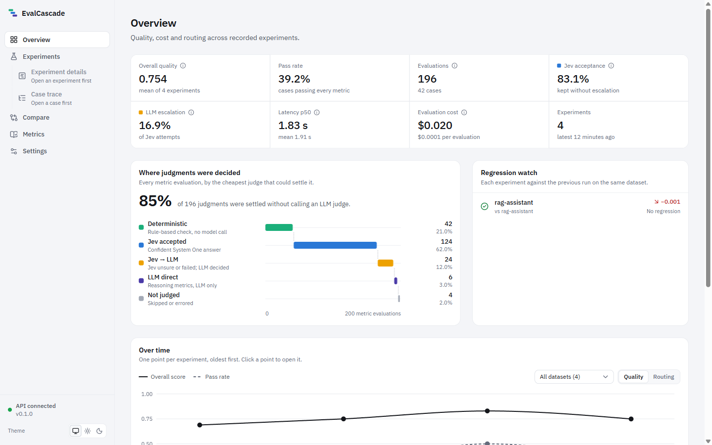
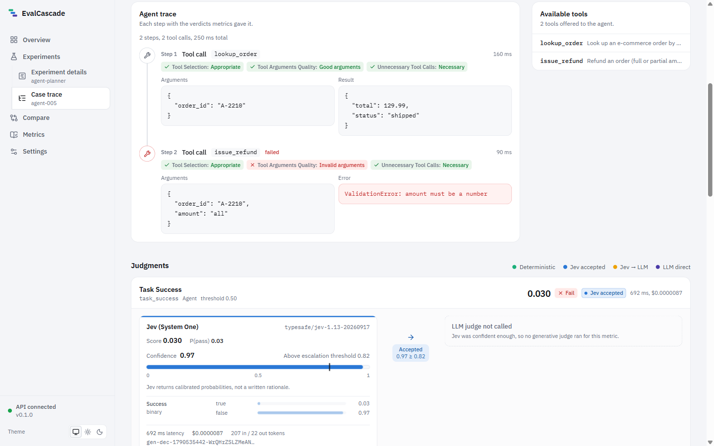
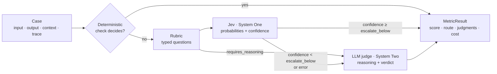
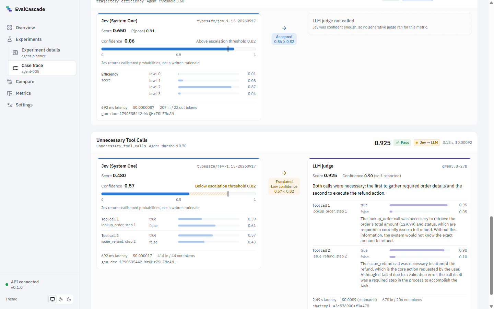
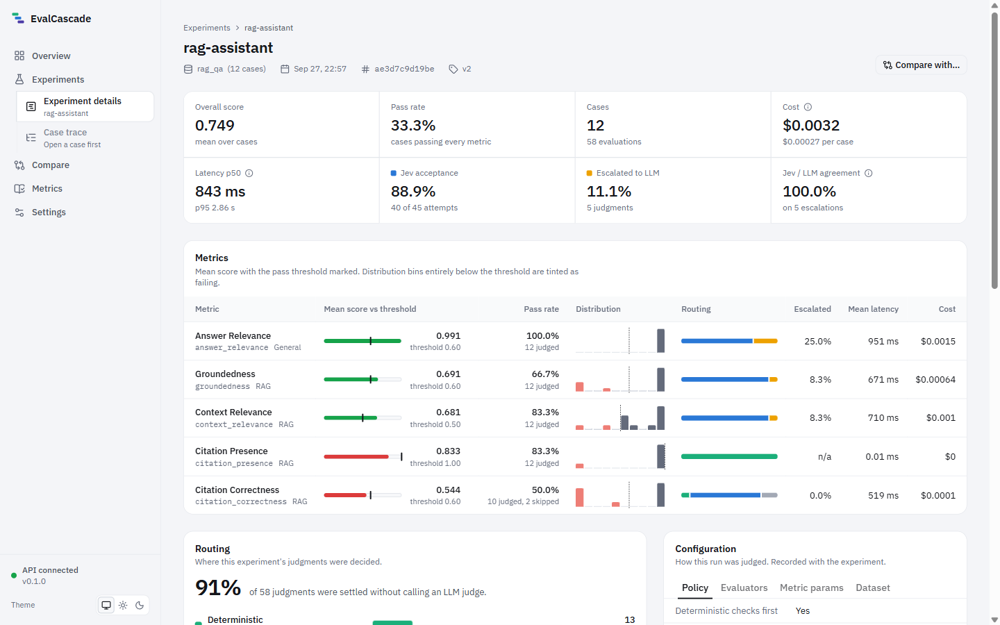
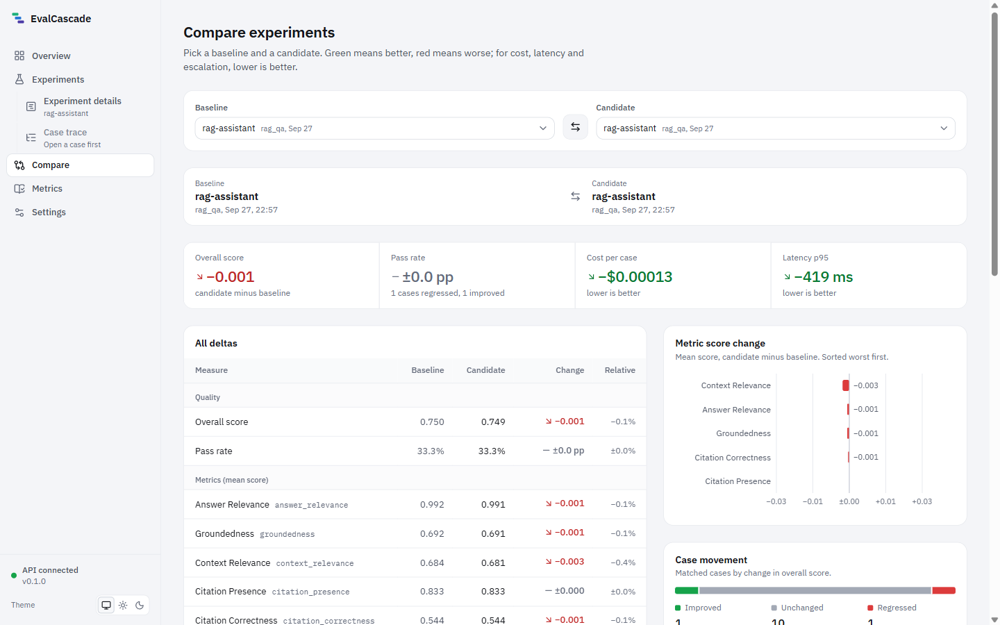
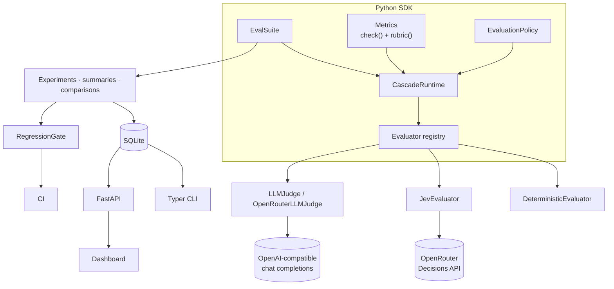

<div align="center">

# EvalCascade

**Open-source adaptive evaluation for LLM, RAG and agentic systems.**<br>
**System One judges first. LLMs only when necessary.**

[](https://github.com/atmaneayoubdev/evalcascade/actions/workflows/ci.yml)
[](pyproject.toml)
[](LICENSE)
[](CHANGELOG.md)
[](pyproject.toml)

</div>

---

Most LLM evaluation pipelines send **every** judgment to a large generative model. That is slow,
expensive and hard to calibrate — even when the question is as simple as "does this answer cite
its sources?" or "is this claim supported by the retrieved passage?".

EvalCascade routes each check to the cheapest evaluator that can answer it well:

1. **Deterministic checks** decide what code can decide — exact matches, citation markers, tool
   schemas, duplicate tool calls, leaked secrets. Free and instant.
2. **Jev (System One)** — [TypeSafe](https://openrouter.ai/typesafe)'s structured decision model —
   answers bounded semantic questions with calibrated probabilities in a single fast call.
3. **An LLM judge (System Two)** is invoked only when Jev's confidence is below a threshold, or when
   a rubric needs deeper reasoning.

Every result keeps the full judgment chain — what Jev decided, how confident it was, whether it
escalated, what the LLM judge said, and what each step cost — so the routing is auditable, and
thresholds can be tuned from data.

<p align="center">
  
</p>

## Contents

[Why adaptive evaluation](#why-adaptive-evaluation) ·
[Installation](#installation) ·
[60-second quickstart](#60-second-quickstart) ·
[Python SDK](#python-sdk) ·
[CLI](#cli) ·
[RAG](#rag-evaluation) ·
[Agents](#agent-evaluation) ·
[The cascade](#the-system-one--system-two-cascade) ·
[Benchmarks](#benchmarks) ·
[Dashboard](#dashboard) ·
[CI gates](#regression-gates-in-ci) ·
[Architecture](#architecture) ·
[Providers](#provider-abstraction) ·
[Roadmap](#roadmap)

## Why adaptive evaluation

Evaluation runs on every pull request, every prompt change and every model upgrade. The judge is
often the most expensive model in the loop — and most of its calls are for questions that do not
need open-ended reasoning.

A System One model returns a **typed decision with a probability distribution** instead of prose.
That buys three things a generative judge struggles with:

- **Cost and latency.** On our benchmark, Jev judged groundedness at roughly 1/22 of the
  (estimated) per-case cost of the LLM judge and about 1/4 of its median latency, at the same
  accuracy ([details](#benchmarks)).
- **Calibration.** Jev's probabilities were better calibrated than the LLM judge's self-reported
  confidence (lower Brier score and ECE) on the same cases.
- **A principled escalation signal.** Confidence tells you *which* judgments deserve a second,
  deeper look — so you pay for System Two only where it can change the answer.

EvalCascade is **not a thin Jev wrapper**: metrics are provider-independent rubrics, evaluators
are pluggable backends, and the policy decides who judges what. Swap in any OpenAI-compatible
judge, add your own evaluator, or run deterministic-only in CI without any API key.

## Installation

Requires Python 3.12+. EvalCascade is not yet published on PyPI; install from GitHub:

```bash
# CLI + SDK into an isolated tool environment
uv tool install git+https://github.com/atmaneayoubdev/evalcascade

# or into the current environment
pip install "evalcascade @ git+https://github.com/atmaneayoubdev/evalcascade"
```

For development (and the bundled dashboard), clone the repository:

```bash
git clone https://github.com/atmaneayoubdev/evalcascade && cd evalcascade
uv sync
uv run evalcascade --help
```

Or run the API + dashboard with Docker:

```bash
cp .env.example .env        # add your OPENROUTER_API_KEY
docker compose up           # http://127.0.0.1:8000
```

## 60-second quickstart

```bash
export OPENROUTER_API_KEY=sk-or-...      # or put it in .env
mkdir my-evals && cd my-evals

evalcascade init                          # evalcascade.toml, local workspace, sample datasets
evalcascade doctor                        # checks Python, database, keys and connectivity
evalcascade run datasets/rag_qa.jsonl --suite rag --name baseline
evalcascade serve                         # API + dashboard at http://127.0.0.1:8000
```

No key yet? `evalcascade demo` seeds clearly-labelled **demonstration** experiments (simulated
judgments, no API calls) so you can explore the dashboard, and `--policy deterministic` runs every
deterministic metric with no key at all.

By default escalations go to `openai/gpt-4.1-mini` on OpenRouter. To use any other
OpenAI-compatible judge (vLLM, SGLang, LiteLLM, a self-hosted gateway, ...):

```bash
export EVALCASCADE_JUDGE_BASE_URL=https://my-endpoint/v1
export EVALCASCADE_JUDGE_API_KEY=...
export EVALCASCADE_JUDGE_MODEL=my-judge-model
```

## Python SDK

```python
from evalcascade import EvalSuite
from evalcascade.metrics import AnswerRelevance, Groundedness, TaskCompletion

suite = EvalSuite(
    metrics=[
        AnswerRelevance(),
        Groundedness(),
        TaskCompletion(),
    ]
)

result = await suite.evaluate(
    input="How long are backups kept on the Starter plan?",
    output="Starter plans keep backups for 7 days.",
    context=["Backups are retained for 30 days on Business plans and 7 days on Starter."],
)

print(result.overall_score)
for m in result.metrics:
    print(m.metric, m.score, m.route, m.escalated)  # e.g. groundedness 1.0 jev False
```

Outside an event loop, use `suite.evaluate_sync(...)` / `suite.run_sync(...)`.

Every `MetricResult` carries the score (0–1), pass/fail against the metric's threshold, the
route (`deterministic`, `jev`, `jev_to_llm`, `llm`), the confidence, both judgments when
escalated, a per-metric explanation, latency and cost.

Evaluate a whole dataset and record an experiment:

```python
from evalcascade.storage import ExperimentStore

experiment = await suite.run(
    "datasets/rag_qa.jsonl", name="baseline", store=ExperimentStore.from_settings()
)
print(experiment.summary.overall_score, experiment.summary.routing.escalation_rate)
```

`run()` also accepts a `task=` callable that generates outputs on the fly from each case, so you
can evaluate a live system instead of pre-recorded outputs. More in [`examples/`](examples).

## CLI

```bash
evalcascade evaluate -i "What is 2+2?" -o "4" -e "4" -m correctness       # one interaction
evalcascade run sample:support_bot --suite general --name nightly         # a dataset
evalcascade datasets import my_cases.jsonl --name support                 # register a dataset
evalcascade experiments list
evalcascade compare baseline nightly                                      # deltas incl. cost & routing
evalcascade gate --baseline baseline --candidate nightly --max-quality-drop 0.03 \
                 --metric-threshold groundedness=0.05                     # exit 1 on regression
evalcascade metrics                                                       # metric catalog
evalcascade serve                                                         # API + dashboard
```

Experiment references accept an id, a unique id prefix, a name (latest run with that name),
`latest`/`latest~1`, or an exported `.json` file. Full reference: [`docs/cli.md`](docs/cli.md).

## RAG evaluation

```python
from evalcascade import EvalSuite
from evalcascade.metrics import (
    AnswerRelevance,
    CitationCorrectness,
    CitationPresence,
    ContextRelevance,
    Groundedness,
)

suite = EvalSuite(
    [
        AnswerRelevance(),
        Groundedness(),
        ContextRelevance(),
        CitationPresence(),
        CitationCorrectness(),
    ]
)
result = suite.evaluate_sync(
    input="Can I restore my Starter database to a specific point in time?",
    output="Yes — every plan supports point-in-time restore [1].",
    context=[
        "Point-in-time restore is available only on Business plans.",
        "The cafeteria opens at 8am.",
    ],
)
result["groundedness"].score  # low: the claim contradicts passage 1
result["context_relevance"].details["passages"]  # per-passage relevance
result["citation_correctness"].details  # does passage [1] support the cited sentence?
```

`CitationPresence` is fully deterministic; `CitationCorrectness` checks deterministically that
each `[n]` points to an existing passage, then asks Jev whether that passage supports the
sentence. `ContextRelevance` asks one yes/no question per passage — Jev answers all of them, and
every other Jev-routed metric of the case, in **one** Decisions call.

## Agent evaluation

```python
from evalcascade import AgentTrace, EvalSuite, ToolCall, ToolSpec, TraceStep
from evalcascade.metrics import build_metrics

trace = AgentTrace(
    tools=[
        ToolSpec(
            name="get_weather",
            description="Weather for a city",
            parameters={
                "type": "object",
                "properties": {"city": {"type": "string"}},
                "required": ["city"],
            },
        )
    ],
    steps=[
        TraceStep(
            tool_call=ToolCall(
                name="get_weather", arguments={"city": "Lisbon"}, result={"temp": 22}
            )
        ),
        TraceStep(
            tool_call=ToolCall(
                name="get_weather", arguments={"city": "Lisbon"}, result={"temp": 22}
            )
        ),
    ],
)
suite = EvalSuite(
    build_metrics(["agent"])
)  # task_success, tool_selection, tool_arguments_quality, ...
result = suite.evaluate_sync(
    input="Weather in Lisbon?",
    output="22 °C.",
    trace=trace,
    expected={"tools": ["get_weather"], "max_tool_calls": 1},
)
```

With ground truth (`expected.tools`, `expected.tool_calls`, `expected.max_tool_calls`) agent
metrics are deterministic; without it they ask bounded per-call questions ("was this call
necessary?"). Duplicate calls and schema violations are always detected by code. Per-step
outcomes land in `details["steps"]` and are drawn on the dashboard's trace timeline.

<p align="center">
  
</p>

## The System One → System Two cascade



**Metrics describe *what* to judge, never *who* judges it.** A metric implements an optional
deterministic `check()` and a provider-independent `rubric()` — a *state* plus typed questions:

| Rubric question | Jev primitive | Normalized score | Confidence |
|---|---|---|---|
| `BinaryQuestion` | `noul` | P(desirable outcome) | `max(p, 1−p)` (Jev reports only P(true)) |
| `ChoiceQuestion` | `choice` | Σ P(option) × option score | Jev's reported `confidence` |
| `ScoreQuestion` (2–10 levels) | `score` | expected level / max level | Jev's reported `confidence` |

<p align="center">
  
  <br><sub>A real escalation: Jev's confidence (0.57) is below <code>escalate_below</code> (0.82), so the same rubric goes to the LLM judge, which explains its verdict. Both judgments are kept.</sub>
</p>

A multi-question rubric (per passage, per sentence, per tool call) is as confident as its least
confident answer. The same rubric goes unchanged to the LLM judge, which answers it under a strict
JSON schema, so both backends are scored identically.

The policy decides the route:

```python
from evalcascade import EvaluationPolicy, MetricPolicy

policy = EvaluationPolicy(
    deterministic_first=True,
    primary="jev",
    fallback="llm",  # the configured judge; "openrouter" or any registered evaluator also work
    escalate_below=0.82,  # global threshold
    overrides={
        "groundedness": MetricPolicy(escalate_below=0.6),  # per-metric threshold
        "safety": MetricPolicy(escalate=False),  # never escalate this metric
    },
)
suite = EvalSuite(metrics, policy=policy)
```

Thresholds resolve as *policy override → metric instance (`Groundedness(escalate_below=…)`) →
global*. Presets: `EvaluationPolicy.cascade()`, `.jev_only()`, `.llm_only()`,
`.deterministic_only()`. Escalation also triggers when Jev errors (`escalate_on_error=True`),
and if the fallback fails the primary judgment is kept and flagged. Experiments track Jev
acceptance rate, escalation rate, Jev↔LLM agreement on escalated cases, and combined cost and
latency — see [`docs/providers.md`](docs/providers.md) for the exact semantics.

## Benchmarks

The benchmark harness compares **Jev-only**, **LLM-judge-only** and the **adaptive cascade** on
labeled data, reporting accuracy (with 95% Wilson intervals), precision, recall, F1, paired exact
McNemar tests, Brier score, expected calibration error with reliability bins, p50/p95 latency,
cost and escalation rate, plus a counterfactual threshold sweep.
Methodology: [`benchmarks/README.md`](benchmarks/README.md).

**Real run, 2026-09-27** — `groundedness` on 150 labeled cases (75 grounded / 75 hallucinated)
derived from [HaluEval](https://github.com/RUCAIBox/HaluEval) (MIT). Jev `typesafe/jev-1.13`;
judge `qwen3.8-27b` on an OpenAI-compatible endpoint (thinking off, temperature 0). Raw results:
[`benchmarks/results/`](benchmarks/results).

| Mode | Accuracy (95% CI) | F1 | Brier ↓ | ECE ↓ | p50 latency | p95 latency | Cost / case | Escalated |
|---|---|---|---|---|---|---|---|---|
| Jev only | 0.800 (0.73–0.86) | 0.815 | **0.146** | **0.123** | **373 ms** | **530 ms** | **$0.000034** | — |
| LLM judge only | 0.807 (0.74–0.86) | 0.822 | 0.180 | 0.173 | 1445 ms | 2166 ms | $0.000760* | — |
| Cascade, τ = 0.82 | 0.820 (0.75–0.87) | 0.834 | 0.169 | 0.157 | 1535 ms | 2361 ms | $0.000553* | 60% |
| Cascade, τ = 0.6 | 0.813 (0.74–0.87) | 0.829 | 0.176 | 0.156 | 396 ms | 2259 ms | $0.000393* | 41% |

\* Judge cost is an **estimate** at OpenRouter's listed price for `qwen/qwen3.8-27b` ($0.42 / $3.00
per M tokens); the endpoint used reports no cost. Jev cost is provider-reported.

How to read this honestly:

- **Accuracy differences are not statistically significant** on this sample (McNemar p ≥ 0.63 for
  every pair). The cascade's higher point estimate is not evidence that it is more accurate.
- Jev alone matched the LLM judge's accuracy at ~1/22 of the estimated cost and ~1/4 of the median
  latency, with better calibration.
- Thresholds matter per metric: at the default τ = 0.82, 60% of groundedness cases escalated
  (Jev's confidence on 4-level score questions is often below 0.82); a tuned τ = 0.6 escalated
  41% with unchanged accuracy and near-Jev median latency.
- This is one task, one public dataset and 150 cases; HaluEval's labels have known artifacts
  (documented in [`benchmarks/data/README.md`](benchmarks/data/README.md)). Measure on your own data.

Reproduce: `uv run python benchmarks/run_benchmark.py --dataset benchmarks/data/halueval_groundedness.jsonl --metric groundedness --param max_passage_chars=8000`
(the Jev part of a full three-mode run costs about $0.01).

## Dashboard

`evalcascade serve` starts the local API and a dashboard (Next.js, served as static files):
overview, experiments, experiment details, side-by-side comparison with an inline regression gate,
case/trace inspection with the full judgment chain, the metric catalog and a configuration
summary. Demonstration data is always badged **DEMO** and never mixed silently with real results.

<p align="center">
  
  
</p>

The dashboard ships in the Docker image; in a clone, build it with
`python scripts/build_dashboard.py` (requires Node 22). For frontend development see
[`web/README.md`](web/README.md).

## Regression gates in CI

```bash
evalcascade experiments export baseline -o evals/baseline.json    # commit the baseline
# in CI:
evalcascade run datasets/rag_qa.jsonl --suite rag --name candidate -o candidate.json
evalcascade gate --baseline evals/baseline.json --candidate candidate.json \
    --max-quality-drop 0.03 --metric-threshold groundedness=0.05 \
    --max-cost-increase 0.25 --summary-file "$GITHUB_STEP_SUMMARY"
```

The gate exits non-zero on a violation and writes a Markdown report to the job summary. Checks:
overall drop, per-metric drops, cost and p95-latency increase, a score floor, a maximum escalation
rate and dataset identity. A ready-to-copy workflow lives in
[`examples/ci/evalcascade-gate.yml`](examples/ci/evalcascade-gate.yml).

## Architecture



| Package | Responsibility |
|---|---|
| `evalcascade.core` | requests & traces, rubric primitives, `Metric` / `Evaluator` bases, policy, cascade runtime, suite |
| `evalcascade.metrics` | 13 metrics (general, RAG, agent) |
| `evalcascade.evaluators` | deterministic, Jev, LLM judges, demo simulator, registry |
| `evalcascade.providers` | HTTP client (timeouts, retries, backoff, redacted errors), typed Jev and chat clients |
| `evalcascade.datasets` / `experiments` / `regression` / `storage` | JSONL datasets, experiment summaries and comparisons, gates, SQLAlchemy persistence |
| `evalcascade.benchmarking` | benchmark harness, calibration and significance statistics |
| `evalcascade.cli` / `api` | Typer CLI, FastAPI server + static dashboard |

Metrics at a glance ([`docs/metrics.md`](docs/metrics.md)):

| General | RAG | Agents |
|---|---|---|
| AnswerRelevance · Correctness · TaskCompletion · Safety | Groundedness · ContextRelevance · CitationPresence · CitationCorrectness | TaskSuccess · ToolSelection · ToolArgumentsQuality · TrajectoryEfficiency · UnnecessaryToolCalls |

## Provider abstraction

- **Jev** is called through OpenRouter's Decisions API (`POST /api/alpha/decisions`, verified
  against OpenRouter's OpenAPI spec and live responses; the TypeSafe-compatible `/api/v1/systemone`
  surface is also supported). Default model `typesafe/jev-1.13` (configurable, e.g.
  `~typesafe/jev-latest`).
- **LLM judges** use any OpenAI-compatible `/chat/completions` endpoint. Structured output is
  requested with a strict JSON schema and downgraded automatically (`json_object`, then
  prompt-only) if unsupported; replies are validated and retried with corrective feedback.
  Cost comes from the provider when reported (OpenRouter), else from configured per-token prices,
  else it is marked unknown — never silently zero.
- **Custom evaluators** implement one method:

```python
from evalcascade.evaluators import RawAnswers, SemanticEvaluator


class MyJudge(SemanticEvaluator):
    name = "mine"

    async def answer(self, rubric) -> RawAnswers: ...  # answer rubric.questions about rubric.state


suite = EvalSuite(
    metrics, evaluators={"mine": MyJudge()}, policy=EvaluationPolicy(primary="jev", fallback="mine")
)
```

Security: keys are read from the environment only, held as `SecretStr`, never logged, stored or
exported; evaluated text is passed to judges strictly as data. See [`SECURITY.md`](SECURITY.md).

## Roadmap

- PyPI release and a pip-installable dashboard bundle
- Claim extraction for sentence-level groundedness; per-step judgments for more agent metrics
- More benchmark tasks (relevance, safety, tool use) and larger samples
- Streaming/online evaluation from traces (OpenTelemetry ingestion)
- Pluggable storage backends (Postgres) and background job execution for large runs
- Auth-aware dashboard sessions for shared deployments

## Contributing

Contributions are welcome — see [`CONTRIBUTING.md`](CONTRIBUTING.md). The test suite runs fully
offline (`uv run pytest`); live provider tests are opt-in with `EVALCASCADE_LIVE_TESTS=1`.

## License

[MIT](LICENSE). The benchmark dataset derived from HaluEval is MIT-licensed by its authors
([`benchmarks/data/LICENSE-HaluEval.txt`](benchmarks/data/LICENSE-HaluEval.txt)).

## Disclaimer

Jev is a third-party model and service provided by TypeSafe and accessed through OpenRouter.
**EvalCascade is an independent open-source project and is not affiliated with, endorsed by, or
sponsored by TypeSafe or OpenRouter.** Model names, prices and API behaviour are described as
observed on 2026-09-27 and may change; check the providers' documentation. Benchmark numbers are
from the saved runs linked above and are not guarantees of performance on your data.
